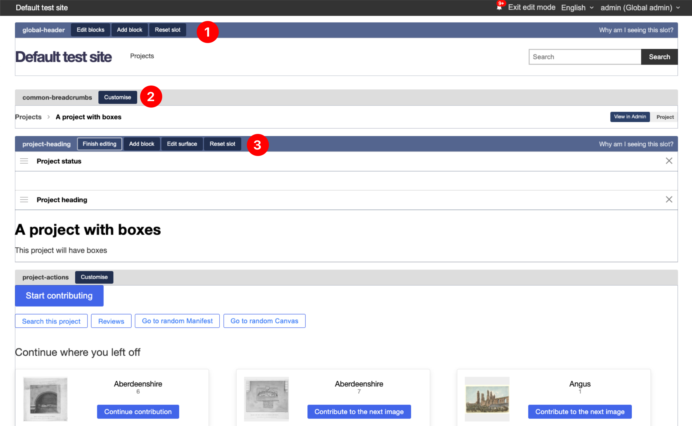

# Custom page blocks

A page block is a React component that can be dropped on most of the pages on Madoc and also on custom pages that have been created. They can be functional or just for presentation.

Almost all UI components on the frontend of the site are Page Blocks. Each page is made up of "slots" that fit into a layout on a page, with each slot containing a default set of blocks that can be customised by the end-user.

.png>)

For example, the Project overview page (`/s/[site]/projects/[project]`) is a React component containing the following code:

```jsx
export function ViewProject() {
  return (
    <>
      <Slot name="common-breadcrumbs">
        <DisplayBreadcrumbs />
      </Slot>

      <Slot name="project-heading">
        <ProjectStatus />
        <ProjectHeading />
      </Slot>

      <Slot name="project-actions">
        <ProjectActions />
        <ProjectContributionButton />
        <ProjectStatistics />
      </Slot>

      <Slot name="project-navigation">
        <ProjectCollections />
        <ProjectManifests />
      </Slot>

      <Slot name="project-footer" />
    </>
  );
}
```

We have 5 slots on this page that can be customised:

* Common breadcrumbs - used across all pages
* Project heading
* Project actions
* Project navigation
* Project footer

Inside each slot are the default **Page blocks** that will be loaded on the page if the user has not made any customisations. Let's take a look at one of these page blocks: `<ProjectHeading />`

```jsx
export function ProjectHeading() {
  const { data: project } = useProject();

  if (!project) {
    return null;
  }

  return (
    <>
      <LocaleString as={Heading1}>{project.label}</LocaleString>
      <LocaleString as={Subheading1}>{project.summary}</LocaleString>
    </>
  );
}

blockEditorFor(ProjectHeading, {
  type: 'default.ProjectHeading',
  label: 'Project heading',
  anyContext: ['project'],
  requiredContext: ['project'],
  editor: {},
});
```

The first line is one of the data loading hooks available across Madoc. This will load a resource automatically based on the URL if the URL contains that resource. This means that even custom pages under a route like `/manifests/123` will have access to the `useManifest()` hook to load that data. Some of the available hooks for loading are:

* `useProject` - Loads a project
* `usePaginatedCollection` - Loads first page of collection, or grabs page number from `?c=`
* `useManifest` - Loads in a manifest, no guarantee on the canvases (for metadata only)
* `usePaginatedManifest` - Loads in first page a manifest, with canvases or grabs page number from `?m=`

There are many hooks available for different sets of data in Madoc, calling various APIs. There are a set of "contexts" used through Madoc that can let you know what resources you are currently "in".&#x20;

* Project / `project`
* Collection / `collection`
* Manifest / `manifest`
* Canvas / `canvas`
* Task / `task`
* Parent task / `parentTask`

Under the component is this "decorator" `blockEditorFor` . This is what will turn the component into a page block.&#x20;

* `type` - this is required, if it's part of a page it should be prefixed with `default.`&#x20;
* `label` - This is used in the UI when presenting the block
* `anyContext` - List of "contexts" that are optional, but that this will use
* `requiredContext` - List of "contexts" that are required for this page block. This will be used to filter which page blocks are available on a given page.
* `editor` - This is a short-hand capture model that can be used to create UI for the page block that will be passed as props (more below).

When you are logged into Madoc as an Admin on a site, you can click on "Edit mode" to see the page slots and blocks.


In this mode you can start editing and adding page blocks, you will see an overview similar to the following



1. At the top of every page is the global header page block. You can see that when a page block has been customised you get 3 actions,  "edit blocks", "add block" and "reset slot"
2. When a slot has not been customised it will appear grey, with a customise button. When you click on it you will see 2 options (Customise only on this page, customise for all types in this context). The first is the most common, the second is not yet properly documented. But you could use this second option to customise ALL canvas pages inside of a project for example.
3. Once you hit customise, the view will change to this. This is the view after clicking "edit blocks". You will see that the list of page blocks are below, with handles on the left for resizing, the label of the block and a `X` to remove the block. If the page block has an `editor` then a small "edit" button will also be visible.

When you click on **Add block** a popup will appear with all the available blocks that match the context you are on. You will also see the blocks at the top that are defaults to the page.


If you add a page block to Madoc, this is where it will appear. When you choose a block with an `editor` property, it will show you the form when you add, alongside a preview of what the block will look like


Once saved, the page block will be added into the slot along side the rest, with the "Edit" button.


### Creating a custom block

When you create a page block that is used on an existing page, it will be "auto-loaded" into the listing pages. However, if a page block is optionally and only accessible in the page block interface the component has to be registered. This section will step through the process from start to finish.

To start, we will simply create a "hello world" component.

```jsx
export function HelloWorld(props) {
  return <div>Hello {props.name || 'world'}!</div>;
}
```

This has a single prop that is optional `name` that we can let the user customise. Let's add the page block decorator in the same file, under our component.

```jsx
blockEditorFor(HelloWorld, {
  type: 'hello-world',
  label: 'Hello world',
  editor: {},
});
```

This is the minimum required, but let's add an editor the `name` property, and add a default. The complete file looks like:

```jsx
export function HelloWorld(props) {
  return <div>Hello {props.name || 'world'}!</div>;
}

blockEditorFor(HelloWorld, {
  type: 'hello-world',
  label: 'Hello world',
  defaultProps: {
    name: 'World', // This will pre-populate the form
  },
  editor: {
    name: { label: 'Enter a name', type: 'text-field'},
  },
});
```

With that addition, our page block is complete. Forms can be much more complex, and there are other options that are available to map forms to more complex components:

* `mapToProps` - takes the JSON from the form and maps to component props
* `mapFromProps` - takes the props and maps to the form structure
* `svgIcon` - Function returning a JSX svg icon, used to display
* `customEditor` - Custom react component to replace the whole editor UI

Now we need to register our component.&#x20;


This may change in the future!&#x20;


In the following file:

```
services/madoc-ts/src/extensions/page-blocks/default-definitions.ts
```

We need to add an extra definition:

```
export const defaultPageBlockDefinitions: PageBlockDefinition<any, any, any, any>[] = [
  // ...
  (HelloWorld as any)[Symbol.for('slot-model')] as any,
];
```

This will ensure that the block is registered and bundled correctly. Now we should be able to go to any page on Madoc and add our block to the page.


And when we add / edit it, we will see our form


And on the page when we hit save, along-side an the edit button to take you back to the form.


And finally on our page!
